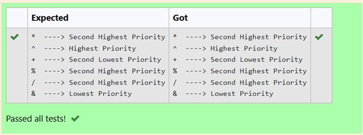

# EX 1(A) Display operator precedence in the infix expression.
## DATE:25-04-2025
## AIM:
To write a C program to find and display the priority of the operator in the given Postfix expression

## Algorithm
1.Start the program.
2.Define the priority() function to return the priority of operators.
3.Initialize the string containing operators and operands.
4.Loop through each character in the string.
5.For each operator, call the priority() function to determine its priority.
6.Print the operator and its corresponding priority level.
7.End.


## Program:
```
/*
Program to find and display the priority of the operator in the given Postfix expression
Developed by: DIVYA E
RegisterNumber:  212223230050
*/
```
```
#include <stdio.h> #include<string.h>
int priority(char x)
{

if(x == '&' || x == '|') return 1;
if(x == '+' || x == '-') return 2;
if(x == '*' || x == '/' || x == '%') return 3;
if(x == '^') return 4;
return 0;
}
int main()
{
int i,j;

char ch[100]="(A*B)^C+(D%H)/F&G";

for(i=0;i<strlen(ch);i++)
{
if(ch[i]=='+'||
ch[i]=='-'||
ch[i]=='*'||
ch[i]=='/'||
ch[i]=='%'||
ch[i]=='^'||
ch[i]=='&'||
ch[i]=='|')
{
j=priority(ch[i]); switch(j)
{
case 1:
printf("%c	> ",ch[i]);
printf("Lowest Priority\n"); break;
case 2:
printf("%c	> ",ch[i]);
printf("Second Lowest Priority\n"); break;
case 3:
printf("%c	> ",ch[i]);
printf("Second Highest Priority\n"); break;
case 4:
printf("%c	> ",ch[i]);
printf("Highest Priority\n"); break;
}
}
}

return 0;
}
```

## Output:



## Result:
Thus the C program to find and display the priority of the operator in the given Postfix expression is implemented successfully
